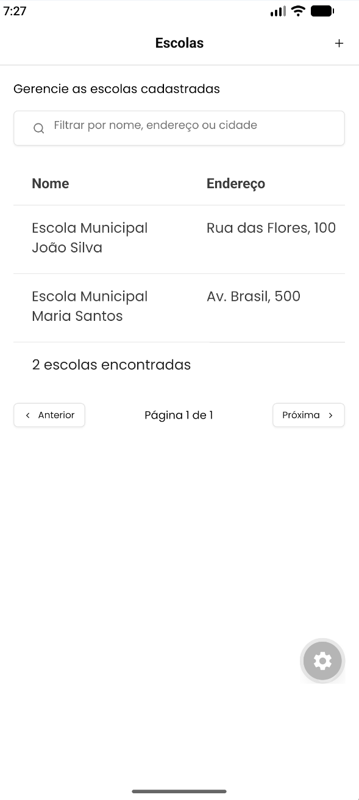
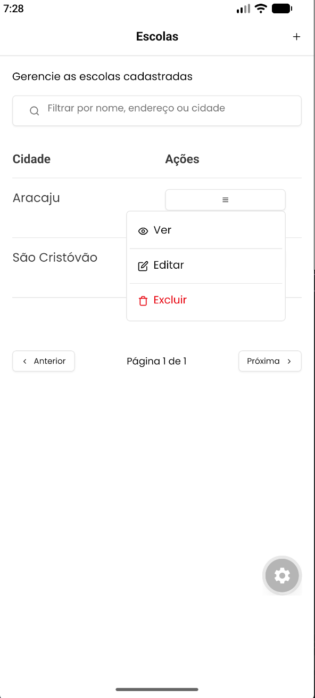
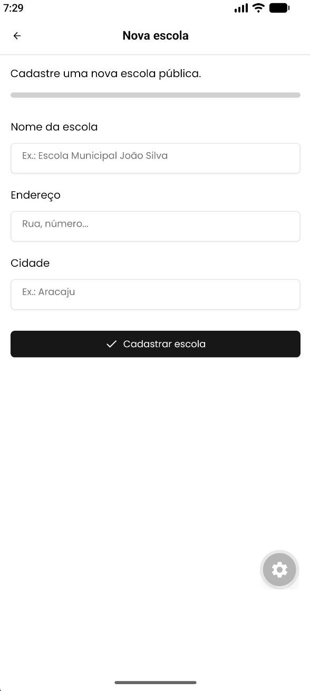
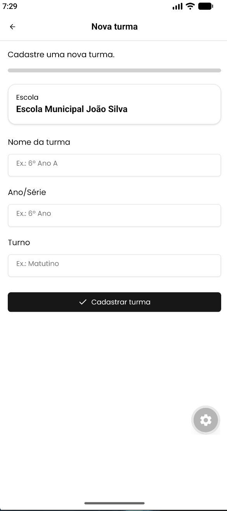

## Organização

A interface fica em `src/app`, com rotas do Expo Router. O que não é tela fica fora dali.

| Parte | Onde | Papel |
| --- | --- | --- |
| Telas | `src/app` | Listas, detalhe, formulários de escola e turma |
| Domínio | `src/domain` | Formato de escola, turma e dos dados de criação e edição |
| Serviços | `src/services` | `fetch` para `http://localhost:3000` |
| Estado | `src/stores` | Zustand: listas, item selecionado e os estados de carregar, salvar e excluir |
| Mocks | `src/mocks` | MSW. Handlers de escola e turma, com dados só na memória |
| Interface | `src/components/ui` | Componentes do Gluestack copiados para o projeto |

## Telas

Listagem de escolas, com filtro e paginação.



Menu de ações da linha: ver, editar e excluir.



Cadastro de uma escola.



Cadastro de uma turma, já vinculada à escola.



## Versões utilizadas

Expo SDK 57, com React Native 0.86 e React 19. A navegação é o Expo Router, a partir de `src/app`.

A interface é Gluestack UI v5 com NativeWind 5 (Tailwind CSS 4). Os componentes usados nas telas incluem botão, campo, cartão, alerta, progresso, spinner, toast, tabela e menu. Os ícones da interface vêm do próprio conjunto do Gluestack. A fonte de texto é Poppins, carregada com `expo-font` e `@expo-google-fonts/poppins` na abertura do app.

O estado das telas fica no Zustand. A API falsa é o MSW 2.

## O que precisa estar instalado

- Node.js na versão LTS atual e npm.
- Um celular com o Expo Go compatível com o SDK 57, ou um emulador Android. No macOS, o simulador do iOS também serve.
- Para o emulador Android, Android Studio com uma imagem de sistema criada.

Não é preciso banco, backend nem conta na Expo para rodar em desenvolvimento.

## Passos de instalação e execução

Na pasta do projeto:

```bash
npm install
npx expo start
```

No terminal do Expo, `a` abre o Android e `w` abre no navegador. No celular, o caminho é o QR code pelo Expo Go, com o aparelho na mesma rede da máquina.

O primeiro start baixa a fonte e sobe o mock. Se a porta 8081 já estiver ocupada por outro `expo start`, encerre esse processo antes de subir de novo.

Para checar os tipos:

```bash
npx tsc --noEmit
```
